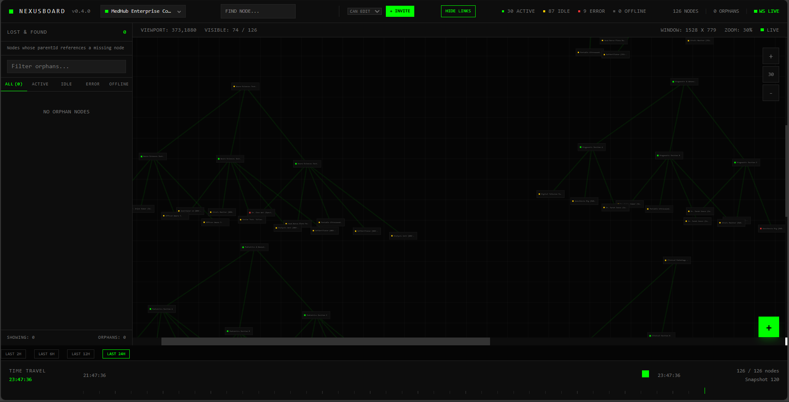
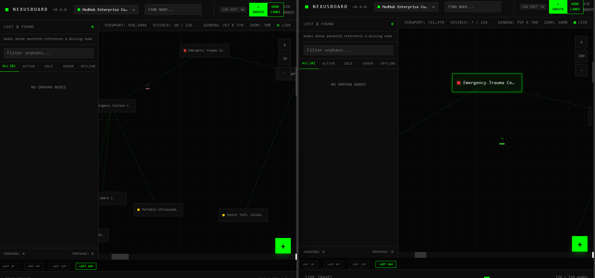

# 🌐 NexusBoard: Collaborative AI Command Center

NexusBoard is a futuristic, high-performance node visualization platform designed for complex infrastructure management. Originally architected as a **Hospital Management System (HMS)**, it enables real-time multi-user synchronization across a massive digital canvas capable of handling over **10,000 active nodes**.

---

## 📸 System Overview

| **Secure Gateway** | **Medical Command Center** |
| :--- | :--- |
|  |  |
| *Encrypted JWT-based authentication gateway.* | *Live 9-Wing Hospital Wing layout.* |

| **Real-Time Collaboration** | **10,000 Node Global Mesh** |
| :--- | :--- |
|  |  |
| *Live cursor tracking with user name tags and colors.* | *Fractal mesh simulation testing performance limits.* |

---

## 🚀 Key Features

* **Collaboration Engine**: Instant WebSocket-based synchronization of cursor movements, node dragging, and content edits.
* **10k Node Performance**: Leverages **viewport virtualization** to render only visible nodes, allowing for ultra-smooth navigation of massive datasets.
* **Time-Travel Debugging**: A specialized timeline slider allows users to reconstruct the state of the network at any point in history.
* **Persistent Relationships**: Custom persistent ID logic ensures parent-child "noodle" links remain intact across sessions and collaborative edits.
* **Dynamic Workspace**: Built-in project switcher to jump between standard hospital maps and high-density stress tests.

---

## 🛠️ Tech Stack

* **Frontend**: React.js, **Tailwind CSS**, Lucide React (Icons).
* **Backend**: Node.js, Express.js.
* **Database**: MongoDB (Mongoose) with optimized batch processing.
* **Real-time**: WebSocket (WS) for bidirectional presence and state sync.
* **Security**: Bcrypt.js for hashing and JWT for session management.

---

## 🚦 Getting Started

### 1. Prerequisites
* [Node.js](https://nodejs.org/) (v16 or higher)
* [MongoDB Atlas](https://www.mongodb.com/cloud/atlas) account or local MongoDB instance.

### 2. Installation

**Clone the Project:**
```bash
git clone [https://github.com/Dakshin211/Nexus-board.git](https://github.com/Dakshin211/Nexus-board.git)
cd Nexus-board
```
Install Frontend Dependencies:


```Bash
npm install
```
Install Backend Dependencies:


```Bash
cd server
npm install
```

3. Environment Configuration
Create a .env file in the server directory:

Plaintext
MONGO_URI=your_mongodb_connection_string
JWT_SECRET=your_secret_key_here
PORT=5000
🖥️ Execution Guide
Step 1: Start the Backend Server
From the server folder:

```Bash
node index.js
```
Step 2: Seed the Professional Data
NexusBoard requires seeded data to demonstrate its hierarchical capabilities:

```Bash
# To generate the Hospital Command Map
node hospital.js
```
# To generate the 10,000 Node Stress Test
node stress_test.js
Step 3: Start the Frontend
Open a new terminal in the root folder:

```Bash
npm run dev
```
Visit http://localhost:3000 to access the system.

🏗️ Usage Instructions
Authentication: Sign up to receive a unique cursor color and username based on your email.

Invite Others: Click the + Invite button in the header to generate a link for collaborators.

Project Switch: Use the top-left dropdown to select "Global Health Mesh (10k Nodes)" to test virtualization performance.

Time Travel: Move the bottom slider to see nodes appear/disappear based on their modification timestamps.


